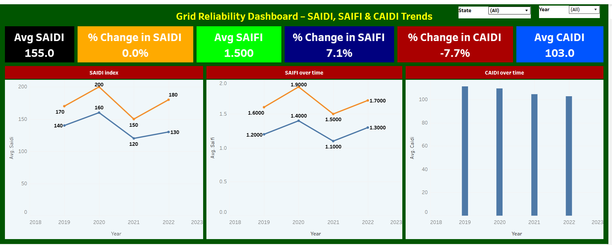

# 🔌 Grid Reliability Analysis Dashboard

**Author**: Janati Nakimera  
**Tools Used**: Tableau, Excel, U.S. EIA Form 861, DOE OE-417, EAGLE-I outage data

---

## 📘 Project Overview

This project presents a Tableau dashboard analyzing electric grid reliability in the United States using real-world data from the U.S. Energy Information Administration (EIA), DOE Major Disturbance Reports (OE-417), and county-level outage records from EAGLE-I. The goal is to visualize and interpret reliability trends through key industry-standard metrics (SAIDI, SAIFI, CAIDI), spatial outage patterns, and the relationship between load and outage frequency.

---

## 🔍 Key Features

- **Reliability Metrics Overview**: Interactive KPI cards showing annual SAIDI, SAIFI, and CAIDI values.
- **Trends Over Time**: Line charts tracking reliability indices from 2018–2022.
- **Outage Map** *(Optional)*: Geographic visualization using latitude and longitude.
- **Cause Analysis** *(if added)*: Breakdown of outages by type such as weather, equipment failure, etc.
- **Executive Insights**: Commentary and annotations for deeper understanding.
- **Filters**: Drop-down controls for state and year selection.

---

## 🧾 Data Sources

- [EIA Form 861](https://www.eia.gov/electricity/data/eia861/)  
- [EAGLE-I Power Outage Dataset](https://www.energy.gov/oe/downloads/eagle-i-real-time-power-outage-data)  
- [DOE OE-417 Major Disturbance Reports](https://www.oe.netl.doe.gov/oe417.aspx)

---

## 📊 Dashboard Preview

> The full interactive dashboard is published on Tableau Public.  
> 👉 [View on Tableau Public](https://public.tableau.com/app/profile/janati.nakimera/viz/GridReliabilityDashboard/GridReliabilityDashboard?publish=yes)

---

## 📁 Repository Structure

---

## 📌 Summary

This dashboard is a standalone portfolio project by **Janati Nakimera**, showcasing advanced Tableau skills and domain knowledge in power systems and grid reliability. The dashboard helps power utilities, analysts, and planners gain meaningful insights from outage and performance data. It supports smarter grid design and policy decisions through compelling visual storytelling.

---

## 👋 Let’s Connect

For questions, suggestions, or opportunities, feel free to [connect with me on LinkedIn](https://www.linkedin.com/in/janati-nakimera).

---

## 📜 License

This repository is intended for academic, professional portfolio, and learning purposes only. All datasets are sourced from publicly available government repositories.
